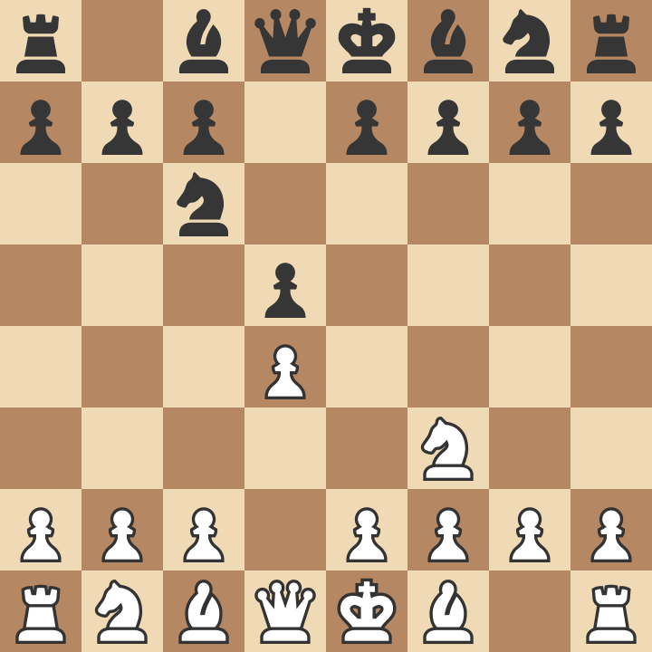

# A Journey of Chess Openings
## A Look at How My Chess Openings Changed Over About 2 Years

### The Start of My Chess in 2020
#### Playing d4 | Queen's Pawn, Chigorin Variation

The Queen's Pawn, Chigorin Variation Opening was a fairly simple first opening to invest time into. It goes 1. d4 d5 2. Nf3 Nc6. The Pawn on d4 is **overproteced** by the white queen and the knight on c6. This makes this a fairly structurally sound center to develop your pieces around and can be used to play a *London System* (mentioned later in the document).

This was the first Chess opening that I played, and it is a very sound opening at beginner and intermediate level. However, in higher levels, as opponents learn various *King's Indian* or *Dutch Defense* variations, you might no longer see 1. d4 **d5** on the board. 
