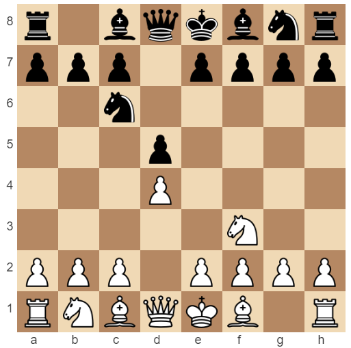
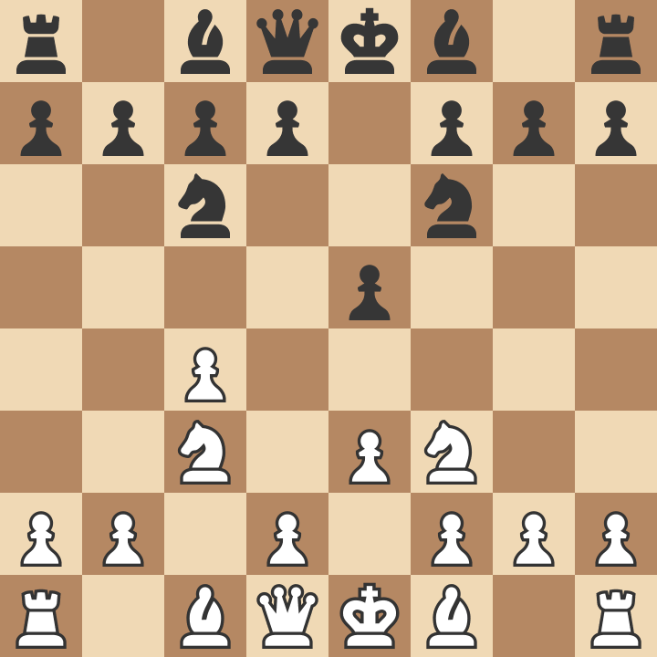

# A Journey of Chess Openings
## A Look at How My Chess Openings Changed Over About 2 Years

### The Start of My Chess in 2020
#### Playing d4 | Queen's Pawn, Zukertort, Chigorin Variation

The Queen's Pawn, Zukertort, Chigorin Variation Opening was a fairly simple first opening to invest time into. It goes 1. d4 d5 2. Nf3 Nc6. The Pawn on d4 is **overproteced** by the white queen and the knight on c6. This makes this a fairly structurally sound center to develop your pieces around and can be used to play a *London System* (mentioned later in the document).

This was the first Chess opening that I played, and it is a very sound opening at beginner and intermediate level. However, in higher levels, as opponents learn various *King's Indian* or *Dutch Defense* variations, you might no longer see 1. d4 **d5** on the board.

#### Playing c4 | English Opening, Four Knights, Quiet Line

The next major opening I played was the English Opening. This is a fairly high level opening that I decided to try out due to its popular usage by Vishwanathan Anand, five-time World Chess Champion and the highest rated Indian Grandmaster. While I attempted to learn some theoretical lines for the opening, I mainly just played the opening by intuition, having played tens of games in the opening when I used to play it. The opening starts 1. c4... 2. Nc3, with many variations. The opening focuses on controlling the center with a **flank pawn**, the c4 pawn. Furthermore, the opening generally forces an English Opening or a Queen's Gambit position on the board, leading to less transformations into other openings. 

My personal favorite variation of the English Opening was the English Opening, Four Knights, Quiet Line, as shown in the picture! I eventually gave up this opening from my repertoire due to the immense ammount of theory that it theoretically required to be played well after a certain point. I still play it from time to time in my modern repertoire!

